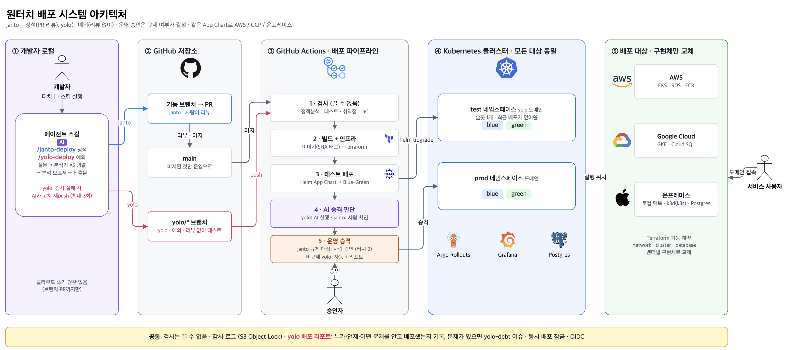
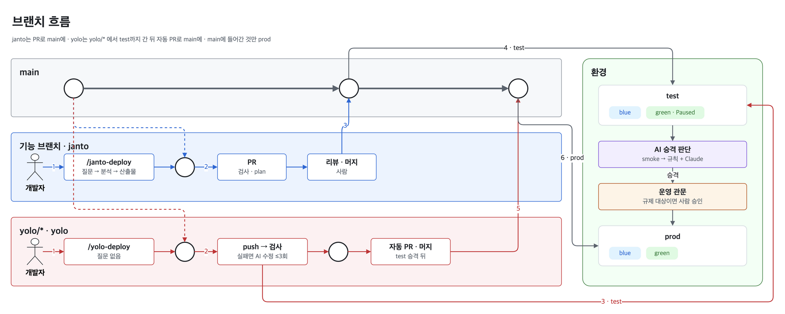
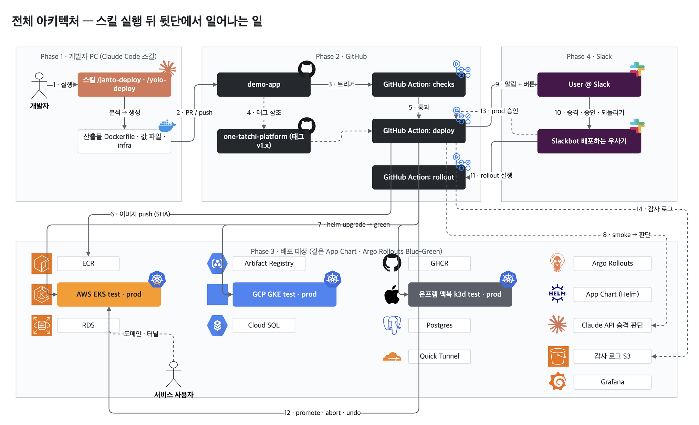

# 완땃찌(원터치) 배포 대 출격!

> `one-tatchi-platform`

<p align="center">
  
</p>

**로컬에서 만든 웹앱을 AI 에이전트가 분석하고, 컴플라이언스 검사를 통과한 변경만 클라우드(AWS · GCP)와 온프레미스에 배포한다.**

금융권처럼 규제가 있는 곳에는 멀티클라우드와 **출구전략**이 필요하지만, 매번 사람이 설계하기는 어렵다.
그래서 정적분석 · 테스트 · 취약점 검사 같은 필수 항목을 **기본 템플릿**으로 먼저 깔아 둔다.
그 위에서 AI 에이전트가 서비스를 분석해 배포 파일을 만들고, 배포 파이프라인이 규칙대로 반영한다.

이 레포는 **기본 템플릿과 에이전트 스킬**을 담는다. 배포 대상 앱은 [`demo-app`](https://github.com/SoftBank-Hackathon-2026-Team-Amethyst/demo-app)에 있다.

## 아키텍처



원본은 [`docs/assets/architecture.drawio`](docs/assets/architecture.drawio) (draw.io로 연다).

스킬을 실행한 뒤 뒷단이 어떻게 움직이는지는 따로 그렸다. 원본은 [`docs/assets/deploy-flow.drawio`](docs/assets/deploy-flow.drawio)(페이지 3개: 배포 흐름 · 전체 아키텍처 · 브랜치 흐름).

| 배포 흐름 | 전체 아키텍처 (Slack 봇 포함) |
|---|---|
|  |  |

브랜치 흐름(main · janto · yolo/* 레인)은 [`docs/assets/deploy-flow-2.png`](docs/assets/deploy-flow-2.png).

## 구성

| 구성 | 설명 |
|---|---|
| `/janto-deploy` | 정석 경로. 질문 → 분석 → 배포 파일 생성 → `main` PR → 사람 리뷰 → 테스트 → 운영 |
| `/yolo-deploy` | 예외 경로. 리뷰 없이 `yolo/*` 브랜치로 테스트까지 가고, 검사가 실패하면 AI가 최대 3회 고친다 |
| 기본 템플릿 | Terraform 모듈, App Chart(Helm), 재사용 워크플로. AI는 변수만 채우고 본문은 고치지 않는다 |
| 배포 파이프라인 | 검사(정적분석 · 테스트 · 취약점 · IaC) → 테스트 배포(Blue-Green) → AI 승격 판단 → 운영 승격. 규제 대상이면 운영 앞에서 사람 승인 |
| `slack-bot/` | 배포 결과를 Slack으로 알리고, 버튼으로 승격 · 롤백을 요청한다 |

## 레포 구조

```
one-tatchi-platform/
├── modules/                    # Terraform 기능 계약 + 벤더별 구현체
│   ├── network/        aws/ gcp/ onprem/
│   ├── cluster/        aws/ gcp/ onprem/
│   ├── cluster_addons/ aws/ gcp/ onprem/
│   ├── registry/       aws/ gcp/ onprem/
│   ├── database/       aws/ gcp/ onprem/
│   ├── ci_identity/    aws/ gcp/ onprem/
│   ├── observability/  aws/ gcp/ onprem/
│   ├── secret/         aws/ gcp/ onprem/
│   └── dns/            aws/ gcp/ onprem/   # 서비스 도메인 존 + 와일드카드 인증서
├── charts/
│   ├── app/                    # App Chart: 릴리스 전략 + 보안 설정 강제. 태그 시 GHCR(OCI)에 배포
│   ├── service-base/           # 서비스 네임스페이스 + DB 시크릿 동기화
│   └── platform-config/        # 클러스터 공통 설정
├── .github/
│   ├── workflows/              # 재사용: checks · infra · deploy · rollout · template-update / 이 레포용: ci · release
│   └── actions/                # 공통 액션 (감사 로그, Slack 알림 등)
├── bootstrap/                  # state 버킷 · 감사 로그 버킷 · OIDC 역할 (최초 1회)
├── skills/                     # 에이전트 스킬 (/janto-deploy, /yolo-deploy, 분석기)
├── slack-bot/                  # 배포 알림 · 조작 Slack 봇 (Socket Mode, 승격 · 취소 · 되돌리기 · PR 머지 버튼)
├── scripts/                    # 보조 스크립트 (템플릿 버전 올리기 등) + tests/
└── docs/                       # ADR, 설계 문서
```

## demo-app이 이 레포를 쓰는 방법

demo-app은 템플릿을 **태그로 고정해 참조**만 한다. 그래서 에이전트가 템플릿 본문이나 검사 단계를 고칠 수 없다.

| 무엇을 | 어떻게 |
|---|---|
| 재사용 워크플로 | `uses: SoftBank-Hackathon-2026-Team-Amethyst/one-tatchi-platform/.github/workflows/deploy.yml@v1.0.0` |
| Terraform 모듈 | `source = "git::https://github.com/SoftBank-Hackathon-2026-Team-Amethyst/one-tatchi-platform.git//modules/cluster/aws?ref=v1.0.0"` |
| App Chart | `helm upgrade … oci://ghcr.io/softbank-hackathon-2026-team-amethyst/charts/app --version 1.0.0` |

세 버전은 demo-app의 `.deploy/config.yaml` → `template_version` 하나로 맞춘다.

### 버전 표기 규칙

새 태그가 나오면 `template-update`가 아래 표기를 한 번에 올리는 PR을 연다(`scripts/bump-template-version.sh`). 이 형식을 벗어나면 갱신되지 않는다.

| 위치 | 형식 |
|---|---|
| `.deploy/config.yaml` | `template_version: v1.0.0` |
| 워크플로 · 액션 참조 | `one-tatchi-platform/...@v1.0.0` |
| 워크플로 입력 | `template-ref: v1.0.0`, `chart-version: 1.0.0` (v 없음) |
| Terraform 모듈 | `one-tatchi-platform.git//modules/...?ref=v1.0.0` |

- `template-ref`는 생략하지 않는다. 기본값 `v1`은 움직이는 태그라 고정이 깨진다.
- 예외: `template-update.yml` 자신은 `@v1`로 호출한다. 업데이트 도구라 최신을 따라가고, 갱신 대상에서도 빠진다.

## 재사용 워크플로

| 워크플로 | 하는 일 |
|---|---|
| `checks.yml` | 정적분석(ruff · lint) · 테스트(pytest, Postgres) · 빌드 · 의존성 취약점(Trivy fs) · IaC 규정(Trivy config). 끄는 입력이 없다 |
| `infra.yml` | Terraform fmt · validate · plan(PR 코멘트) / apply. 감사 로그 · Slack 알림 |
| `deploy.yml` | 이미지 빌드(SHA 태그) → App Chart(OCI)로 `helm upgrade` → green이 Paused가 될 때까지 대기 → 주소 · 감사 로그 · Slack(promote/abort 버튼) |
| `rollout.yml` | Blue-Green 승격 · 취소 · 되돌리기. slack-bot 버튼이 대상 레포의 rollout 워크플로를 거쳐 호출한다. 감사 로그에 요청자(`requested-by`) |
| `template-update.yml` | 이 레포의 새 태그를 확인해 버전 표기를 올리는 PR을 연다(본문에 CHANGELOG 구간). 열린 PR이 main과 충돌하면 main 기준으로 다시 만들어 같은 브랜치에 밀어 넣는다(대상 레포는 main push도 트리거). GitHub App 토큰 사용 |

이 레포 자체는 `ci.yml`(모듈 validate · 차트 lint · IaC 검사 · scripts 테스트)과 `release.yml`(태그 `vX.Y.Z` → 차트를 GHCR에 push, 메이저 태그 `v1` 이동, 대상 레포에 `repository_dispatch`)로 관리한다.

## 팀원 작업 방법

1. [프로젝트 보드](https://github.com/orgs/SoftBank-Hackathon-2026-Team-Amethyst/projects/1)나 [`docs/tasks.md`](docs/tasks.md)에서 맡은 작업을 찾는다. 진행 상황의 기준은 보드(이슈)다.
2. 브랜치에서 작업하고 PR로 올린다. `main`은 보호돼 있어 CI가 통과해야 머지된다(리뷰 승인 불필요).
3. 커밋 메시지와 PR 제목 앞에 `[T번호]`. 끝낸 할 일은 **이슈에서** 체크한다. 보드 이동, tasks.md 체크박스 갱신, Slack 알림은 자동이다.
4. Claude Code에서는 `/todo-task`, Codex에서는 `$todo-task`로 이 과정을 스킬로 진행할 수 있다.

## 문서

- [설계 문서](docs/plan.html): 브라우저로 열어 본다 (다이어그램은 Mermaid로 그려진다)
- [해야 할 일](docs/tasks.md): 단계별 작업과 역할 분담
- [에이전트 스킬](skills/README.md): `/janto-deploy` · `/yolo-deploy`와 하위 스킬, 설치(`scripts/install-skills.sh`), 두 경로의 차이

## 작업 현황

[Softbank 2026 project](https://github.com/orgs/SoftBank-Hackathon-2026-Team-Amethyst/projects/1) 보드와 이 레포의 이슈를 본다.
